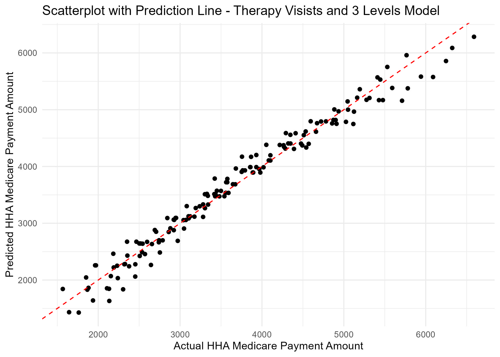

```{r setup, include=FALSE}
knitr::opts_chunk$set(echo = TRUE)
library(tidyverse)
library(htmltools)
library(knitr)
#Put Necessary Libraries Here
```

# INTRODUCTION

AFTER WORKING WITH THE DATA AND DISCUSSING THE INFORMATION WITH YOUR GROUP, YOU SHOULD DESCRIBE 2 QUESTIONS THAT ARE CREATIVE AND INNOVATIVE. YOU SHOULD EXPLAIN WHY THESE QUESTIONS ARE INTERESTING AND WHY THEY DESERVE FURTHER INVESTIGATION. I ADVISE TO THINK OF REASONS WHY AN OWNER OF THE DATA MIGHT BENEFIT FROM ANSWERS TO THESE QUESTIONS. THINK OF REASONS WHY THE WORLD MAY BE INTERESTED IN THESE QUESITONS. THE PURPOSE OF THE INTRODUCTION IS TO STATE SOME INTERESTING QUESTIONS AND DEFEND THE VALUE OF THESE QUESTIONS. THIS INTRODUCTION SHOULD BE WRITTEN IN A WAY THAT SHOULD GET THE READER EXCITED ABOUT SEEING YOUR RESULTS. THIS SHOULD BE WRITTEN IN NO MORE THAN 4 PARAGRAPHS.

A Home Health Agency, or HHA, is an organization that provides health-care services to a patient's residence. While a traditional healthcare agency required the patient to travel to it, a HHA travels to the patient. Home Health Agencies and Home Health Aides are extremely vital in the healthcare world, providing needed medical care to patients who may be more suited to stay at home. For patients who are handicapped, elderly, frail, and sensitive to traditional healthcare settings, Home Health Agencies are an absolute necessity. Unfortunately, healthcare is expensive and especially so for patients who may not be able to leave their residence for traditional healthcare. This is where Medicare is vital to these patients. With Medicare, patients who may not have be able to afford at-home healthcare now can.

In this paper, we seek to answer two questions about Home Health Agencies and how Medicare plays a part in them.

First we wanted to ask: Is there a way to predict how much per visit that Medicare will, on average, pay for the cost of the healthcare? This question is valuable to know for patients who may be in-need of a Home Health Organization and are expecting to use Medicare to help pay for healthcare visits. To do this, we will have to analyze how the cost covered by Medicare changes depending on various variables. This will be important as we will determine what factors are the most important when it comes to Medicare aid.

SECOND QUESTION

# DATA

IN LESS THAN 6 PARAGRAPHS, YOU SHOULD DESCRIBE THE DATA USED TO ANSWER THE QUESTIONS. YOU SHOULD EXPLAIN WHERE THE DATA ORIGINATED. FOR EXAMPLE, IT IS GOOD TO KNOW WHO COLLECTED THE DATA. JUST BECAUSE THE DATA CAME FROM KAGGLE, DOESN'T MEAN KAGGLE.COM COLLECTED THE DATA. GIVE AN IN-DEPTH DESCRIPTION OF THE SPECIFIC VARIABLES IN THE DATA REQUIRED TO ANSWER YOUR QUESTIONS. YOU SHOULDN'T DISCUSS ALL VARIABLES IN THE DATA IF YOU DIDN'T USE ALL VARIABLES IN THE DATA. YOU SHOULD EXPLAIN WHAT EACH OBSERVATION REPRESENTS (I.E. PEOPLE, SCHOOLS, STATES, CITIES, PATIENTS FROM A SPECIFIC HOSPITAL). WHAT IS THIS A SAMPLE OF? HOW MANY OBSERVATIONS DO YOU HAVE? AFTER READING THIS SECTION, THE READER SHOULD CLEARLY UNDERSTAND THE SOURCE AND CONTENT OF THE DATA YOU PLAN ON UTILIZING TO ANSWER YOUR QUESTIONS THAT YOU PROPOSED IN THE INTRODUCTION. AT LEAST ONE, DESCRIPTIVE TABLE AND AT LEAST ONE FIGURE SHOULD BE USED HERE TO HELP THE READER UNDERSTAND WHAT THE DATA LOOKS LIKE WITHOUT SEEING THE ENTIRE DATASET. IN ALL FIGURES AND TABLES, ONLY THE VARIABLES OF INTEREST SHOULD BE USED.

Our data was collected by The Chronic Conditions Data Warehouse and is presented by the Home Health Agency Utilization and Payment Public Use File. There is also information that describes the Medicare provides which was provided by the Centers for Medicare and Medicaid Services. All the data in our overall data set is for the years 2013 and 2015. The overall data set is comprised of small sets of data that range from information about the specific Home Health Agencies described in the data to the cost breakdown for various groupings of 153 Home Health Resource Groups (HRRGs). 

For question 1 we used the **medicare-home-health-agency-hha-hhrg-aggregate-report-cy-2015** data set. This specific data set provides information about how much Medicare provided for **153** different HHRG codes. A HRRG code, also know as a case mix score, is a standardized categorical system to group resources use for Medicare providers (NAHC/Source needed). These codes are made up using various variables such as **Expected Therapy Visits**, **Clinical Severity Level**, **Functional Status Level** and **Service Utilization Domain Level**. Also used in the analysis of this question was the **Average HHA Medicare Payment Amount**. This is a variable that was created by dividing the **Total HHA Medicare Payment Amount** by the **Total Episodes**, where the **Total HHA Medicare Payment Amount** is the total amount that Medicare provided for each specific HHRG and the **Total Episodes** is the total count of distinct episodes provided by a HHA in 2015. Many of these variables were not initially given to us in the data set, so they were created by separating the data to create unique, categorical variables. 

```{r, echo = F}
includeHTML("OG Data.html")
```

This table shows the first 10 rows of the full, 153 variable data set which was used to answer Question 1. The table includes the all variables mentioned above. In the table the variables **Expected Therapy Visits**, **Clinical Severity Level**, **Functional Status Level** and **Service Utilization Level** were all extracted from a single variable in the original data set called **HHRG Description**. The variable was separated to allow more precise modeling of the data. The **Expected Therapy Visits** variable is the total number of therapy visits that are expected for people grouped together. The **Clinical Severity Level** is a variable ranged from 1 to 3 which details how bad the patient's clinical condition is. The **Functional Status Level** variable, also ranged 1 to 3 described how functional the patient is. Finally, the **Service Utilization Level**, ranged 1 to 5, details how much service is expected to be needed for the patients within that group.

# RESULTS

IN LESS THAN 6 PARAGRAPHS FOR EACH OF THE TWO QUESTIONS, YOU SHOULD DESCRIBE THE METHODOLOGY YOU USED TO ANSWER EACH QUESTION AND THE RESULTS FROM IMPLEMENTING THAT METHODOLOGY. YOU ARE FREE TO USE ANY MODELING TECHNIQUES OR STATISTICAL TESTS. YOU ARE NOT RESTRICTED TO METHODS DISCUSSED IN THIS CLASS. I HIGHLY ENCOURAGE YOU TO EXPLORE MORE ADVANCED TECHNIQUES THAT ARE APPROPRIATE GIVEN YOUR QUESTIONS. I HIGHLY ENCOURAGE MULTIPLE TECHNIQUES TO BE CONSIDERED TO ANSWER EACH QUESTION. FOR EXAMPLE, MULTIPLE MODELS CAN BE USED TO EXPLORE THE IMPACT OF MULTIPLE PREDICTOR VARIABLES ON 1 EXPLANATORY VARIABLE. ALL DISCOVERIES AND REVELATIONS ABOUT YOUR QUESTIONS SHOULD BE CLEARLY STATED. BY THE END OF READING THIS SECTION, THE READER SHOULD KNOW THE ANSWERS TO YOUR QUESTIONS BASED ON DATA AND NOT OPINION. IF ANY RESULTS SEEM TO BE UNUSUAL, YOU ARE FREE TO GIVE OPINIONS AND IDEAS WHY CERTAIN PHENOMENON EXIST. ALWAYS THINK CREATIVELY AND USE AT LEAST 4 FIGURES AND/OR TABLES IN THIS SECTION TO HELP THE READER VISUALIZE WHAT YOU ARE TRYING TO EXPLAIN. 

## QUESTION 1

(Needs to be answered to show that we used linear modeling to try to predict the average cost covered by medicare based on the various variables. We used a cross validation to create linear models. Since the data set only contained 153 rows, we could not split the data into train and test. We had to use every HHRG and create predictions that way. Doing so showed us that the number of therapy visits was the largest factor in predicting price based of the RMSE. Based off this information, we could then include multiple regressions into our models, by using the other variables. Using these other variables greatly increased our predictions to show that we could hypothetically use these variables to predict. By using the therapies and all severity variables, we created a fairly accurate model.)

```{r, echo = F}
includeHTML("rmse_table.html")
```

```{r, echo = F}

```

## QUESTION 2

# CONCLUSION
IN LESS THAN 4 PARAGRAPHS, YOU SHOULD RESTATE YOUR QUESTIONS ALONG WITH YOUR CONCLUSIONS. THE PURPOSE OF THIS SECTION IS TO SUMMARIZE YOUR FINDINGS (SHORT), DEFEND THE IMPORTANCE OF YOUR RESULTS IN THE REAL WORLD (LONG), AND PROVIDE A ROADMAP FOR OTHERS TO CONTINUE THIS WORK (LONG). ARE YOUR CONCLUSIONS WHAT YOU EXPECTED OR UNUSUAL? WHY SHOULD SOMEONE CARE ABOUT THESE RESULTS? HOW COULD THESE RESULTS BE USED IN THE REAL WORLD? YOU SHOULD PROVIDE IDEAS ABOUT FUTURE DIRECTIONS ON WHERE YOUR MODELING COULD POSSIBLY BE IMPROVED. ARE THERE ANY METHODS YOU DIDN'T USE THAT MAY WORK BETTER? IS THERE DATA YOU DIDN'T HAVE ACCESS TO THAT MAY BE USEFUL IN THIS DATA ANALYSIS? 


